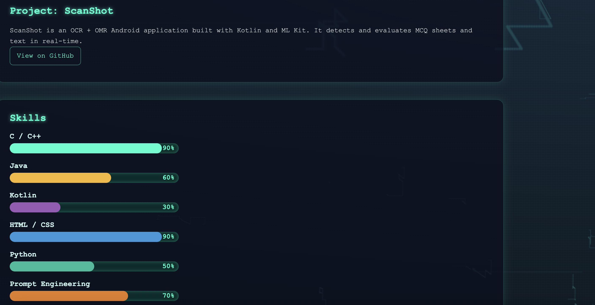
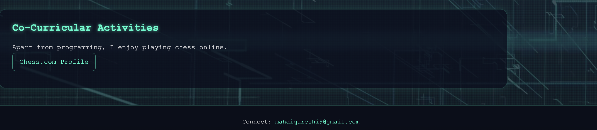

## 🚀 Hero Section Preview

---

## 🧩 How This Section Works

The **Hero Section** contains:

- **Profile Image** with neon glow  
- **Name & Introduction** in glowing text  
- **Quick Links**:  
  `Codeforces`, `CodeChef`, `AtCoder`, `GitHub`

---

## 📄 HTML Structure

```html
<div class="hero">
  <div class="container hero-content">
    <div class="portrait">
      
    </div>
    <div class="bio">
      <h1>Mahdi Hasan Qurishi</h1>
      <p>
        I'm a competitive programmer, 3rd year CSE student at Shahjalal University of Science and Technology.  
        Passionate about AI, ML, and Android development.
      </p>
      <div class="links">
        <a href="https://codeforces.com/profile/ENIGMAH">Codeforces</a>
        <a href="https://www.codechef.com/users/disaster_101">CodeChef</a>
        <a href="https://atcoder.jp/users/enigmah_00">AtCoder</a>
        <a href="https://github.com/Enigmah-00">GitHub</a>
      </div>
    </div>
  </div>
</div>

```
## 🎨 CSS Highlights

```css
.hero {
  background: radial-gradient(ellipse at top left, #07121e 0%, #0c0f1c 100%);
  padding-top: 80px;
}

.hero-content {
  display: flex;
  gap: 40px;
  align-items: center;
}

.portrait img {
  width: 300px;
  border-radius: 12px;
  box-shadow: 0 0 20px #00ffcce0;
}

.bio h1 {
  color: #00ffcc;
  text-shadow: 0 0 10px #00ffcc88;
}

.links a {
  display: inline-block;
  padding: 8px 16px;
  border: 1px solid #00ffcc80;
  color: #00ffcc;
  text-decoration: none;
  border-radius: 8px;
  transition: background 0.3s;
}

.links a:hover {
  background: #00ffcc22;
}
```

## 🗂️ Features Summary

| Feature             | Description                              |
|--------------------|------------------------------------------|
| Neon Profile Image  | Adds a glowing effect to the profile picture |
| Glowing Name Text   | Uses text-shadow for cyberpunk look      |
| Flex Layout         | Places image and bio side by side        |
| Quick Links         | Button-style links with hover interaction |

---


## 🧩 How This Section Works

The **Competitive Programming Stats** contains: 

- an image of graph of problem solving

---


## 📄 HTML Structure

```html
  <section class="section container" id="stats">
    <h2>Competitive Programming Stats</h2>
    
  </section>
```


## Projects and skill preview

## 📄 HTML Structure

```html
  <section class="section container" id="projects">
    <h2>Project: ScanShot</h2>
    <p>
      ScanShot is an OCR + OMR Android application built with Kotlin and ML Kit. It detects and evaluates MCQ sheets and text in real-time.
    </p>
    <div class="links">
      <a href="https://github.com/Enigmah-00/project2-2" target="_blank">View on GitHub</a>
    </div>
  </section>

  <section class="section container" id="skills">
    <h2>Skills</h2>
    <ul class="skills">
      <li>
        <span>C / C++</span>
        <div class="skill-bar">
          <div class="skill-level ccpp" style="width: 90%;"></div>
          <span>90%</span>
        </div>
      </li>
      <li>
        <span>Java</span>
        <div class="skill-bar">
          <div class="skill-level java" style="width: 60%;"></div>
          <span>60%</span>
        </div>
      </li>
      <li>
        <span>Kotlin</span>
        <div class="skill-bar">
          <div class="skill-level kotlin" style="width: 30%;"></div>
          <span>30%</span>
        </div>
      </li>
      <li>
        <span>HTML / CSS</span>
        <div class="skill-bar">
          <div class="skill-level htmlcss" style="width: 90%;"></div>
          <span>90%</span>
        </div>
      </li>
      <li>
        <span>Python</span>
        <div class="skill-bar">
          <div class="skill-level python" style="width: 50%;"></div>
          <span>50%</span>
        </div>
      </li>
      <li>
        <span>Prompt Engineering</span>
        <div class="skill-bar">
          <div class="skill-level prompt" style="width: 70%;"></div>
          <span>70%</span>
        </div>
      </li>
      <li>
        <span>Web Development</span>
        <div class="skill-bar">
          <div class="skill-level webdev" style="width: 10%;"></div>
          <span>10%</span>
        </div>
      </li>
      <li>
        <span>Managing Skill</span>
        <div class="skill-bar">
          <div class="skill-level management"></div>
          <span>∞</span>
        </div>
      </li>
    </ul>
  </section>
```
## 🎨 CSS Highlights

```css

.graph-img {
  width: 100%;
  margin-top: 20px;
  border-radius: 12px;
  box-shadow: 0 0 20px #00ffcc55;
}

/* Skills */
.skills {
  list-style: none;
  max-width: 400px;
}

.skills li {
  margin-bottom: 20px;
  color: #ccf6f2;
}

.skills li span:first-child {
  font-weight: bold;
  margin-bottom: 6px;
  display: block;
  font-size: 1.1rem;
}

.skill-bar {
  background: #002c2a;
  border-radius: 12px;
  overflow: hidden;
  height: 24px;
  position: relative;
  display: flex;
  align-items: center;
  justify-content: flex-end;
  padding-right: 10px;
  font-weight: bold;
  color: #00ffcc;
  box-shadow: 0 0 8px #00ffcc55 inset;
}

.skill-level {
  position: absolute;
  left: 0;
  top: 0;
  bottom: 0;
  border-radius: 12px;
  transition: width 0.5s ease-in-out;
  z-index: 0;
}

.skill-level.ccpp { background: #00ffcc; }
.skill-level.java { background: #f7b731; }
.skill-level.kotlin { background: #9b59b6; }
.skill-level.htmlcss { background: #3498db; }
.skill-level.python { background: #1abc9c; }
.skill-level.prompt { background: #e67e22; }
.skill-level.webdev { background: #95a5a6; }

.skill-level.management {
  width: 100%;
  background: linear-gradient(270deg, #ff00ff, #00ffff, #ff00ff);
  background-size: 400% 400%;
  animation: infinity 3s linear infinite;
}

@keyframes infinity {
  0% { background-position: 0% 50%; }
  100% { background-position: 100% 50%; }
}

/* Ensure text is above the bar */
.skill-bar span {
  position: relative;
  z-index: 1;
}
```
## 🗂️ Features Summary
- project link can be accessed directly
- added colorful skill bars



## Co-curricular activities and contact at footer


## 📄 HTML Structure

```html
  <section class="section container" id="cocurricular">
    <h2>Co-Curricular Activities</h2>
    <p>
      Apart from programming, I enjoy playing chess online.
    </p>
    <div class="links">
      <a href="https://www.chess.com/member/enigmah_00" target="_blank">Chess.com Profile</a>
    </div>
  </section>

  <footer>
    <p>Connect: <a href="mailto:mahdiqureshi9@gmail.com">mahdiqureshi9@gmail.com</a></p>
  </footer>
```
## 🎨 CSS Highlights

```css
footer {
  text-align: center;
  padding: 30px 20px;
  background: #0a0e1a;
  border-top: 1px solid #00ffcc33;
  color: #cccccc;
  font-size: 0.9rem;
}

footer a {
  color: #00ffcc;
  text-decoration: none;
}
```

## Background video


## 📄 HTML Structure

```html
  <video autoplay muted loop id="bgVideo">
    <source src="images/vecteezy_data-neural-network-ai-technology-cloud-computing-bits_21723042.mp4" type="video/mp4">
    Your browser does not support HTML5 video.
  </video>
```

